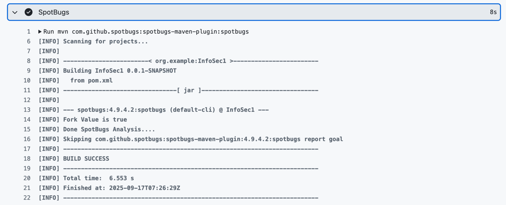

# Работа 1: Разработка защищенного REST API с интеграцией в CI/CD

## Описание проекта и API (какие эндпоинты есть, как их вызывать)

В рамках лабораторной было реализовано защищённое API со следующими эндпоинтами:

POST /auth/login — аутентификация пользователя (возвращает JWT-токен).

POST /auth/register — регистрация нового пользователя.

GET /api/data — получение пользовательских данных. Доступ только с валидным токеном.

POST /api/data — создание нового элемента данных, привязанного к пользователю.

## Меры защиты

### SQL Injection:

- защита с помощью Spring Data JPA (Hibernate), Все методы репозиториев (findByUsername, findByUserUsername)
  автоматически генерируют параметризованные SQL-запросы, без прямой подстановки строк.

### XSS:

- API возвращает только DTO-объекты (DataItemDto, AuthResponse), исключая прямой возврат JPA-сущностей

### Broken Authentication:

- пароли хранятся только в хэшированном виде (алгоритм BCrypt);
- При успешной аутентификации создаётся JWT, подписанный секретным ключом (HS256).
- Все запросы к /api/** проходят через JwtAuthenticationFilter.
  Фильтр:
    - достаёт токен из заголовка;
    - проверяет его подпись и срок действия;
    - извлекает username;
    - помещает авторизацию в SecurityContext с ролью ROLE_USER

## Скриншоты отчетов SAST/SCA

### SAST (spotbugs)

### SCA (Snyk)

[Ссылка на pipiline](https://github.com/dariayo/info-security-lab1/actions/runs/17790068700/job/50564907965)