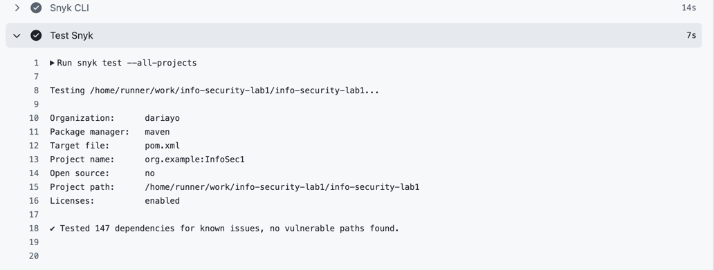

# Работа 1: Разработка защищенного REST API с интеграцией в CI/CD

## Описание проекта и API (какие эндпоинты есть, как их вызывать)

В рамках лабораторной было реализовано защищённое API со следующими эндпоинтами:

POST /auth/login — аутентификация пользователя (возвращает JWT-токен).

``` bash
curl -X POST http://localhost:9999/auth/login \
 -H "Content-Type: application/json" \
 -d '{
   "username": "testuser",
   "password": "password123"
 }
```

GET /api/data — получение пользовательских данных. Доступ только с валидным токеном.

``` bash
curl -X GET http://localhost:9999/api/data \
  -H "Authorization: Bearer YOUR_TOKEN_HERE"
```

POST /api/data — создание нового элемента данных, привязанного к пользователю.

``` bash
curl -X POST http://localhost:9999/api/data \
  -H "Authorization: Bearer YOUR_TOKEN_HERE" \
  -H "Content-Type: application/json" \
  -d '{
    "title": "Test Item",
    "description": "This is a test item"
  }'
```

## Меры защиты

### SQL Injection:

- защита с помощью Spring Data JPA (Hibernate), Все методы репозиториев (findByUsername, findByUserUsername)
  автоматически генерируют параметризованные SQL-запросы, без прямой подстановки строк.

### XSS:

- Все пользовательские строковые данные экранируются с помощью `HtmlUtils.htmlEscape()` перед сохранением в базу данных.

### Broken Authentication:

- пароли хранятся только в хэшированном виде (алгоритм BCrypt);
- При успешной аутентификации создаётся JWT, подписанный секретным ключом (HS256).
- Все запросы к /api/** проходят через JwtAuthenticationFilter.
  Фильтр:
    - достаёт токен из заголовка;
    - проверяет его подпись и срок действия;
    - извлекает username;
    - помещает авторизацию в SecurityContext с ролью ROLE_USER

## Скриншоты отчетов SAST/SCA

### SAST (spotbugs)


### SCA (Snyk)




[Ссылка на pipeline](https://github.com/dariayo/info-security-lab1/actions/runs/17798356083)